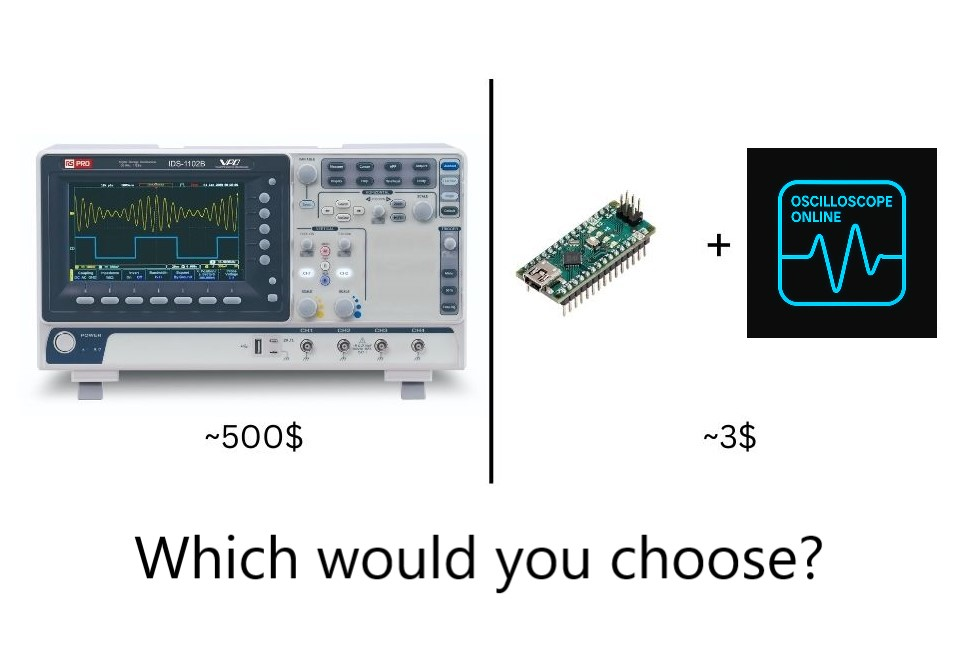

---

# Benefit

## 🔧 Key Features

- **Enhanced User Interface**  
  A cleaner, more intuitive UI for a seamless user experience.

- **Light & Dark Mode Support**  
  Switch between light and dark themes based on your preference or environment.

- **Plug and Play**  
  No installation required—simply open the link and start using immediately.

- **Multiple Export Options**  
  Export as a `.csv`, `.png` and even `.svg`

- **Import from CSV**  
  CSV files which follow the pattern `Time, Graph1, Graph2...` where the first line is the headings, can be imported. This is also the format of the exports. (Time is always in ms).

- **MCU Commands**  
  Trigger exporting and clear data commands via custom special chars from the MCU.

- **Custom Communication Settings**  
  Define your own baud rate, break characters for flexible serial communication.
  
- **Offline Access**  
  Fully local functionality—download the repo and host the site locally for use without an internet connection.

- **Unlimited Plotting**  
  Visualize as many data streams as you need without restrictions.

- **Real-Time Console Logging**  
  View raw serial data logs alongside plotted visuals.

- **Flexible Plotting Options**  
  Plot data by index or timestamp depending on your use case.

- **Multiple Scale Types**  
  Choose between linear, logarithmic (base 2), and logarithmic (base 10) scales.

- **Auto-Scaling Y-Axis**  
  Automatically adjusts the Y-axis range for optimal data visibility.

- **Support for Null Values**  
  Handles incomplete or missing data gracefully during plotting.

- **Auto CLS**
  Automatically clears screen after the number of collected data has passed a pre-defined threshold.

- **Interactive Visualization**  
  Zoom in and explore plots dynamically with a responsive, interactive graphing interface.

### Example of Interactivity

---

## 📈 Plotting Modes

The plotter supports three distinct modes to fit a variety of use cases, ranging from general-purpose visualization to precision timing:

- **Index Mode**  
  Plots data against its sequence index. This mode creates a consistent and unchanging X-axis where each point represents the order in which the data was received.

- **Automatic Time Scaling**  
  Utilizes the system's internal clock to timestamp data upon arrival and uses those values on the X-axis. Suitable for general time-based plotting, but may not offer precise millisecond accuracy due to background processing delays.

- **Manual Time Scaling**  
  Treats the first value in each data packet as the timestamp (typically in milliseconds). Ideal for high-precision plots—especially when using functions like `millis()` in Arduino-based applications. This mode offers the most reliable timing accuracy for microcontroller data.

### Example of Time Scale feature

## 📤 Data Format

The plotter expects incoming data to follow this structure:

Value1 &lt;break_char&gt; Value2 &lt;break_char&gt; Value3 ...\n

- Each value should be separated by the configured **break character**.
- The data line must end with a newline (`\n`).

### 🧹 Clear Screen Command

To clear all previously collected data, simply send:

CLS_char\n

This will reset the plotter and erase existing data.

### ⏱ Manual Time Scaling Note

If you're using **Manual Time Scale** mode, the first value (Value1) is treated as the **timestamp in milliseconds**.  
This is ideal for use with millis() in Arduino or similar microcontrollers.

## ⚙️ Setup Page

All configuration options are available on the **Setup** page.  
You can customize parameters such as baud rate, break/CLS characters, plot types, and more.

A built-in **Help** section is also provided to explain the purpose and functionality of each setting—perfect for new users or quick reference.

## 🎨 Themes

The application supports both **Light** and **Dark** themes to suit different environments and user preferences.

You can toggle between themes anytime.  
Your selected theme is automatically applied across all pages for a consistent visual experience.

## 🌐 Browser Requirements

To ensure full functionality, your browser must support the following:

- **Web Serial API** – Required for direct communication with serial devices.  
  *Supported in Chromium-based browsers like Chrome, Edge, and Opera.*

- **JavaScript** – Core functionality and interactivity rely heavily on JavaScript.

- **HTML5** – Ensures proper rendering of structural elements.

- **CSS3** – Required for styling, responsive layout, and theming (Light/Dark Mode).

## Made with uPlot

